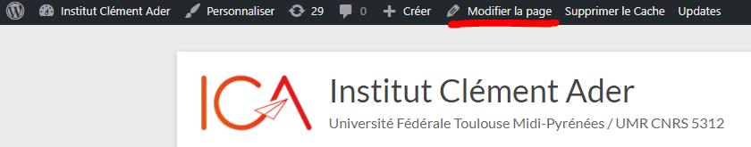

============
Introduction
============

Définition de la documentation
==============================

Cette documentation a pour but d'aider un développeur ne connaissant pas l'environnement de travail 
de l'Institut Clément Ader à pouvoir trouver des repères dans le code.

.. warning::

   Il y a deux site ICA, ICA Prod est le site utilisé par lu public et les internes à l'ICA et le site ICA PréProd qui 
   permet de tester des modifications pour le site sans le rendre innutilisable pour le public. 

Vous trouverez ici l'aborescence du site : `Arborescence des fichiers <https://www.gloomaps.com/nVPbNqnqAl>`__

Le site est divisé en plusieurs partie pour faciliter la lisibilité.
Premièrement les pages se situent dans le dossier App.
Celui-ci contient les dossiers Public et Intranet que nous verrons plus tard.
De plus des fichiers se trouvent dans ce même dossier, ce sont des fichiers "globaux" qui seront utilisés 
dans la plupart des pages.

.. important::

   Certaines pages utilisées dans l'intranet peuvent aussi être utilisées dans la partie public. 
   Lors de modifications, il est important d’effectuer des tests de non régression.

Le dossier Public
-----------------

Le dossier public regroupe toutes les applications et fichiers de la partie publique du site. Ces pages 
ne nécéssitent pas une connexion au site ICA et sont disponibles pour tous.

Le dossier Intranet
-------------------

Le dossier Intranet regroupe toutes les applications et fichiers faisant partie de l'Intranet du site. Ces pages
nécéssitent une connexion pour y accéder et permettent la gestion des pages ouverte au public. Par exemple : La partie 
gestion des theses de l'Intranet permet de gerer les theses vues par le public sur le site ICA.

La gestion sur WordPress
========================

Les snippet 
-----------

Les snippets sont des widget définis sur WordPress, ils représentent le chemin d'accès vers une page php. Ces snippets sont réutilisables lors de la composition d'une page.
Pour éviter de réecrire la totalité du code nous faisons appel à un widget snippet dans le gestionnaire de page WordPress.

Pour gérer les snippets appelés dans les pages wordPress il suffit d'aller dans la catégorie **XYZ PHP Code** dans la liste du menu WordPress.

Voici un lien pour aller directement sur la page des snippet : `Snippet WordPress <https://ica.cnrs.fr/wp-admin/admin.php?page=insert-php-code-snippet-manage>`__

Les pages
---------

Pour la gestion des pages nous pouvons soit cliquer sur le bouton **Modifier la page** représenté sur la page ci-dessous.

Tout comme pour les snippet on peut aussi retrouver les pages dans la liste du menu WordPress avec la catégorie **Pages**

Voici un lien pour aller directement sur la liste des pages. `Pages WordPress <https://ica.cnrs.fr/wp-admin/edit.php?post_type=page>`__

Les pods
--------

L'extension **Pods** WordPress ajoute l'utilisation des pods sur notre site.

Les pods sont des tables WordPress permettant de créer des tables de la base de donnée, ces tables seront utilisées dans phpMyAdmin.
Pour les pods utilisés dans le code on peut aussi les retrouver la liste du menu WordPress avec la catégorie **Administration** et ensuite sélectionner **Pods Page**

Voici un lien pour aller directement sur la liste des pods page. `Pods Page WordPress <https://ica.cnrs.fr/wp-admin/admin.php?page=pods>`__

Les tableaux WordPress
----------------------

Il est possible de trouver de nombreux tableaux sur le site ICA cependant ils ne sont pas tous codés de la même façon.
Pour certains nous faisons appel à des pods spéciaux car ils sont liés à des tableaux WordPress.
Pour les retrouver il faut se diriger vers la liste du menu WordPress avec la catégorie **Administration** et ensuite sélectionner **Pods Templates**

Voici un lien pour aller directement sur la liste des pods template permettant l'utilisation des tableaux. `Pods Template WordPress <https://ica.cnrs.fr/wp-admin/edit.php?post_type=_pods_template>`__